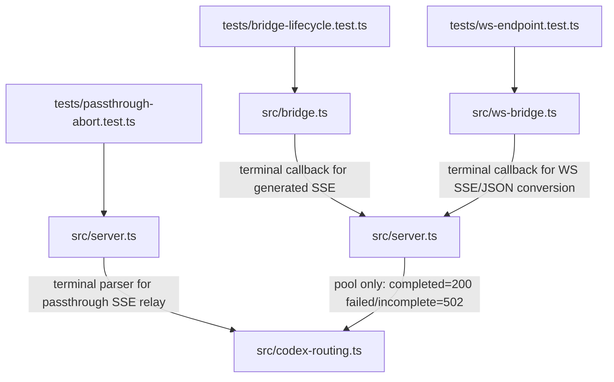

# 50E - Phase 50E Plan: Terminal Stream Outcome Recording

Date: 2026-06-24

Status: planned, audit-revised.

## Objective

Finish the Patch 5 outcome-classification gap where an upstream request can return HTTP 200 headers, but the actual Responses stream later ends as `response.failed`, `response.incomplete`, malformed SSE, or EOF-before-terminal.

After this phase, selected pool-account health will reflect the final stream/application outcome, not only the first HTTP status line.

## Non-Developer Summary

Some failures happen after the server already sees `200 OK`, especially with streaming responses. Today those late failures can look healthy to the account router. This phase makes the stream bridge report the real ending: completed stays healthy, failed/incomplete counts as a transient account failure. It applies to HTTP SSE passthrough, generated SSE bridge responses, and WebSocket conversion.

## File Change Map



## Acceptance Criteria

- HTTP passthrough SSE streams that emit `response.failed` or `response.incomplete` record a transient outcome for the selected pool account after the terminal frame.
- HTTP passthrough SSE streams that end before any Responses terminal frame record a transient outcome.
- Generated bridge SSE streams call a terminal callback for `completed`, `failed`, and `incomplete`.
- WebSocket SSE pumping calls a terminal callback for `response.completed`, `response.failed`, `response.incomplete`, and EOF/protocol stream failures.
- WebSocket JSON conversion calls the same terminal callback for JSON `status: completed|failed|incomplete`.
- Terminal outcome recording has exactly one owner per request:
  - HTTP response bodies record inside `handleResponses()`.
  - WebSocket turns disable internal body terminal recording in `handleResponses()` and record during WS conversion only.
- Passthrough HTTP SSE with initial `200` does not record success at header time. Its account health is recorded only when the terminal stream outcome is observed.
- The server records terminal outcomes only when `authCtx.kind === "pool"`.
- Pool health recording is further limited to response bodies whose upstream actually used the selected Codex forward credential. A selected pool account must not affect health for unrelated routed non-forward providers.
- Completed terminal outcome records success (`200`); failed/incomplete/protocol terminal outcomes record transient failure (`502`).
- No account id, email, token, local alias, or payload text is added to logs or returned errors.
- Existing abort behavior remains intact: client cancellation must not be recorded as a provider/account failure.

## Diff-Level Plan

### MODIFY `/Users/jun/Developer/new/700_projects/opencodex/src/bridge.ts`

Add exported type:

```ts
export type ResponsesTerminalStatus = "completed" | "failed" | "incomplete";
```

Extend `bridgeToResponsesSSE()` options:

```ts
options?: {
  responseId?: string;
  stallTimeoutSec?: number;
  hideThinkingSummary?: boolean;
  onTerminal?: (status: ResponsesTerminalStatus) => void;
}
```

Inside `bridgeToResponsesSSE()`:

- add a local `terminalReported` guard;
- add a local `clientCancelled` guard set by `cancel()`;
- add `reportTerminal(status)` that calls `options?.onTerminal?.(status)` once;
- make `reportTerminal(status)` a no-op when `clientCancelled` is true;
- call `reportTerminal("completed")` when adapter emits `done`;
- call `reportTerminal("failed")` when adapter emits `error` or the bridge catches an exception;
- call `reportTerminal("incomplete")` for stall timeout and adapter EOF without terminal;
- do not call the callback from `cancel()`, because client cancellation is not an upstream account failure.
- still report stall timeout before closing the stream; stall timeout is an upstream/application terminal, not client cancellation.

### MODIFY `/Users/jun/Developer/new/700_projects/opencodex/src/ws-bridge.ts`

Import `ResponsesTerminalStatus` type from `./bridge`.

Add a local reporting type:

```ts
type ResponsesTerminalReporter = (status: ResponsesTerminalStatus) => void;
```

Change `pumpResponsesSseToWebSocket()` options to:

```ts
options: { isCurrent?: () => boolean; onTerminal?: ResponsesTerminalReporter } = {}
```

Inside SSE pumping:

- add a local `terminalReported` guard;
- add a local `clientCancelled` guard set inside the `ws.data.cancel` hook;
- make `reportTerminal(status)` a no-op when `clientCancelled || !isCurrent()`;
- parse payload type as it already does;
- on `response.completed`, report `completed`;
- on `response.failed`, report `failed`;
- on `response.incomplete`, report `incomplete`;
- on invalid JSON, EOF-before-terminal, and read errors, report `incomplete` before sending the standalone protocol error;
- do not report when `isCurrent()` is false or the stream is cancelled by a newer turn.
- do not report when the socket close path calls `ws.data.cancel?.()` while `isCurrent()` is still true.

Change `sendResponsesJsonAsEvents()`:

```ts
export function sendResponsesJsonAsEvents(
  ws: ServerWebSocket<WsData>,
  response: Record<string, unknown>,
  onTerminal?: ResponsesTerminalReporter,
): void
```

Report the final JSON status after sending the final event.

Change `sendResponseToWebSocket()`:

```ts
export async function sendResponseToWebSocket(
  ws: ServerWebSocket<WsData>,
  response: Response,
  isCurrent: () => boolean,
  options: { onTerminal?: ResponsesTerminalReporter } = {},
): Promise<void>
```

Pass `options.onTerminal` through to SSE and JSON conversion paths.

### MODIFY `/Users/jun/Developer/new/700_projects/opencodex/src/server.ts`

Import `ResponsesTerminalStatus` type.

Add a narrowly-scoped helper:

```ts
function codexForwardTerminalOutcomeRecorder(
  config: OcxConfig,
  authCtx: CodexAuthContext,
  provider: OcxProviderConfig,
): ((status: ResponsesTerminalStatus) => void) | undefined {
  if (authCtx.kind !== "pool") return undefined;
  if (provider.authMode !== "forward" || provider.adapter !== "openai-responses") return undefined;
  return status => recordCodexUpstreamOutcome(config, authCtx.accountId, status === "completed" ? 200 : 502);
}
```

This guard preserves the Phase 10 invariant: quota/upstream outcome recording uses the pool account id only for Codex forward/passthrough upstream responses, not unrelated non-forward routed provider responses.

Add `handleResponses()` option:

```ts
recordTerminalOutcomes?: boolean;
setTerminalOutcomeRecorder?: (recorder: ((status: ResponsesTerminalStatus) => void) | undefined) => void;
```

Default behavior:

- `recordTerminalOutcomes` defaults to true.
- HTTP `/v1/responses` uses the default, so returned streaming bodies record terminal outcome internally.
- WebSocket calls `handleResponses(..., { recordTerminalOutcomes: false, ... })`.
- When `handleResponses()` reaches an actual Codex forward passthrough response, it calls `setTerminalOutcomeRecorder(recorder)` so the WebSocket handler can pass that recorder to `sendResponseToWebSocket()`.
- For non-forward generated bridge responses, no recorder is set and pool health is not mutated.
- This prevents duplicate terminal health updates for the same generated or passthrough SSE body.

Extend `relaySseWithHeartbeat()` signature:

```ts
export function relaySseWithHeartbeat(
  body: ReadableStream<Uint8Array> | null,
  upstream: AbortController,
  heartbeatMs = 15_000,
  onTerminal?: (status: ResponsesTerminalStatus) => void,
): ReadableStream<Uint8Array> | null
```

Inside `relaySseWithHeartbeat()`:

- parse complete SSE blocks while relaying bytes;
- inspect only `data:` JSON payloads for `type`;
- support split chunks, CRLF block delimiters, and multiline `data:` fields with the same behavior expected by WebSocket SSE tests;
- ignore `data: [DONE]` unless a terminal status was already seen;
- report `completed|failed|incomplete` when seen;
- report `incomplete` if upstream body ends without a terminal frame;
- do not report in `cancel()`.
- use a local `terminalReported` guard and a local `clientCancelled` flag so cancel/close does not turn into an incomplete outcome.

Update server call sites:

- compute `isEventStream` before recording upstream status in the passthrough block.
- preserve quota header capture/update before returning.
- if `authCtx.kind === "pool"` and `isEventStream && upstreamResponse.ok`, do not record `upstreamResponse.status` immediately; let the relay terminal parser record `200` or `502`.
- if `authCtx.kind === "pool"` and `(!isEventStream || !upstreamResponse.ok)`, keep immediate status recording with `retry-after`/reset metadata.
- create the recorder with `codexForwardTerminalOutcomeRecorder(config, authCtx, route.provider)` only inside the passthrough/forward path.
- passthrough SSE response body uses `relaySseWithHeartbeat(upstreamResponse.body, upstream, 15_000, recorder)` only when `recordTerminalOutcomes !== false`; otherwise omit the relay terminal callback and expose the recorder through `setTerminalOutcomeRecorder`.
- bridge-generated SSE terminal callbacks remain generic library behavior; server does not attach pool health recording for non-forward generated bridge responses.
- WebSocket `sendResponseToWebSocket()` uses `{ onTerminal: recorderFromHandleResponses }`, where `recorderFromHandleResponses` is set only by the actual Codex forward passthrough path.
- WebSocket calls `handleResponses()` with `recordTerminalOutcomes: false`.

`/Users/jun/Developer/new/700_projects/opencodex/src/web-search/loop.ts` is explicitly out of scope for this phase. Its sidecar/main-loop execution already receives sidecar status recording from Phase 50C, and threading terminal callbacks through the model-loop abstraction is a separate design slice. Phase 50E covers the server response path that directly owns selected pool auth context.

### MODIFY `/Users/jun/Developer/new/700_projects/opencodex/tests/bridge-lifecycle.test.ts`

Add tests:

- generated bridge reports `completed` terminal callback on adapter `done`;
- generated bridge reports `failed` terminal callback on adapter `error`;
- generated bridge reports `incomplete` terminal callback on adapter EOF without terminal;
- cancelled bridge stream does not report terminal outcome, including an adapter generator that reacts to cancellation by throwing or returning.

### MODIFY `/Users/jun/Developer/new/700_projects/opencodex/tests/ws-endpoint.test.ts`

Add tests:

- `pumpResponsesSseToWebSocket()` reports `failed` for `response.failed`;
- `pumpResponsesSseToWebSocket()` reports `incomplete` for EOF before terminal;
- `pumpResponsesSseToWebSocket()` does not report a terminal outcome when `ws.data.cancel!()` is called while `isCurrent()` remains true;
- `sendResponseToWebSocket()` reports `failed` for JSON `status: "failed"`;
- stale/non-current responses do not report a terminal outcome.
- one WebSocket path test proves a generated failed stream records exactly one terminal outcome, not one from `handleResponses()` plus one from WS conversion.
- one negative test proves a generated non-forward stream with an active pool account does not mutate pool upstream health.

### MODIFY `/Users/jun/Developer/new/700_projects/opencodex/tests/passthrough-abort.test.ts`

Add tests:

- `relaySseWithHeartbeat()` reports `failed` when relaying a `response.failed` SSE payload;
- `relaySseWithHeartbeat()` reports `incomplete` when upstream closes before a terminal Responses payload;
- cancelling the relay does not report terminal outcome.
- CRLF and multiline `data:` terminal payloads report correctly.
- split terminal frames report correctly.
- `data: [DONE]` before a terminal payload reports incomplete at EOF rather than success.
- invalid JSON payloads do not leak payload text and report incomplete at EOF if no terminal status is observed.

### MODIFY `/Users/jun/Developer/new/700_projects/opencodex/tests/server-auth.test.ts`

Add a focused server-level passthrough SSE regression:

- seed the selected pool account with two transient failures;
- upstream fetch returns HTTP `200`, `content-type: text/event-stream`, and terminal `response.failed`;
- consume the returned response body;
- assert account health reaches the failover threshold instead of being reset by the initial `200`.

Add a negative attribution regression:

- configure an active pool account but route the request to a non-forward provider such as `openai-chat`;
- upstream emits a generated bridge stream failure/completion;
- consume the response body;
- assert `getCodexUpstreamHealth(poolId)` is still null.

Add a WebSocket attribution regression if practical in this file; otherwise keep it in `/Users/jun/Developer/new/700_projects/opencodex/tests/ws-endpoint.test.ts` with the `setTerminalOutcomeRecorder` behavior:

- a WebSocket conversion callback must not be supplied for non-forward generated responses.

## Verification Plan

Focused:

```bash
bun test tests/server-auth.test.ts tests/bridge-lifecycle.test.ts tests/ws-endpoint.test.ts tests/passthrough-abort.test.ts tests/codex-routing.test.ts
```

Full:

```bash
bun run typecheck
bun test tests
cd gui && bun run build
git diff --check
git status --short
```

Independent verification:

- read-only verifier checks terminal callback coverage, no double-reporting, cancellation semantics, server pool-only attribution, and PII safety.

## Out Of Scope

- Persisting stream terminal health across process restart.
- Using exact upstream embedded error codes to classify `response.failed` as credential/quota. This slice records late stream failure conservatively as transient `502`.
- UI display for terminal stream failure reason.
- Web-search loop terminal callback plumbing in `/Users/jun/Developer/new/700_projects/opencodex/src/web-search/loop.ts`.

## Plan Audit Fixes

- Defer passthrough SSE `200` health recording until the terminal stream event.
- Add `recordTerminalOutcomes` ownership so HTTP bodies and WebSocket conversion cannot both record the same stream.
- Add explicit client-cancel guards in both generated bridge SSE and WebSocket SSE pumping.
- Mark `src/web-search/loop.ts` out of scope for this slice.
- Expand passthrough SSE parser tests for CRLF, multiline, split chunks, `[DONE]`, invalid JSON, EOF, and cancel semantics.
- Add server-level regression for the premature `200` reset bug and a WebSocket duplicate-recording regression.
- Restrict pool-health attribution to actual Codex forward passthrough responses; add negative coverage for non-forward generated streams with an active pool account.

## Build Evidence

Status: implemented in B.

Implementation files:

- `/Users/jun/Developer/new/700_projects/opencodex/src/bridge.ts`
  - Added `ResponsesTerminalStatus`.
  - Added optional `onTerminal` support to `bridgeToResponsesSSE()`.
  - Reports `completed`, `failed`, and `incomplete` once for generated SSE terminal outcomes.
  - Suppresses terminal reporting after client cancellation.
- `/Users/jun/Developer/new/700_projects/opencodex/src/ws-bridge.ts`
  - Added optional terminal reporting to SSE pumping, JSON conversion, and `sendResponseToWebSocket()`.
  - Reports EOF/protocol stream failures as `incomplete` only when the turn is current and not client-cancelled.
  - Keeps terminal callbacks generic; no account ids or payload text are passed to the callback.
- `/Users/jun/Developer/new/700_projects/opencodex/src/server.ts`
  - Added `usesCodexForwardPoolAuth()` and `codexForwardTerminalOutcomeRecorder()` so account health updates are scoped to actual `openai-responses` forward passthrough requests using the selected pool credential.
  - Deferred passthrough SSE 200 health recording until the terminal SSE payload.
  - Added `recordTerminalOutcomes` / `setTerminalOutcomeRecorder` ownership so HTTP records internally and WebSocket records only during WS conversion.
  - Added terminal observation to `relaySseWithHeartbeat()` while preserving byte-for-byte relay semantics.
- `/Users/jun/Developer/new/700_projects/opencodex/tests/bridge-lifecycle.test.ts`
  - Added generated bridge terminal callback tests for completed, failed, incomplete, and cancellation.
- `/Users/jun/Developer/new/700_projects/opencodex/tests/ws-endpoint.test.ts`
  - Added WebSocket terminal callback tests for failed, incomplete, JSON failed/completed, stale turns, and cancellation.
- `/Users/jun/Developer/new/700_projects/opencodex/tests/passthrough-abort.test.ts`
  - Added passthrough SSE terminal parser tests for failed, EOF incomplete, cancel, CRLF/multiline, split chunks, `[DONE]`, and invalid JSON.
- `/Users/jun/Developer/new/700_projects/opencodex/tests/server-auth.test.ts`
  - Added server-level regression proving passthrough SSE terminal failure does not get erased by initial HTTP 200.
  - Added negative attribution regression proving non-forward generated streams do not mutate active pool health.

Verification evidence:

- `bun test tests/server-auth.test.ts tests/bridge-lifecycle.test.ts tests/ws-endpoint.test.ts tests/passthrough-abort.test.ts tests/codex-routing.test.ts` -> 81 pass, 0 fail.
- `bun run typecheck` -> pass (`bun x tsc --noEmit`).

Privacy evidence:

- Terminal callbacks receive only `completed`, `failed`, or `incomplete`.
- The new server recorder maps status to numeric `200` or `502` and does not log account id, email, token, alias, or stream payload text.
