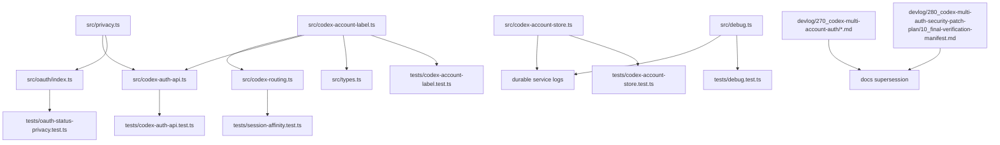

# 60 - Phase 60 Plan: Privacy Labels, Log Redaction, And Final Docs

Date: 2026-06-25

Status: planned, audit-revised.

## Objective

Close Patch 6 from `devlog/280_codex-multi-auth-security-patch-plan/00_patch_plan.md`.

This phase reduces remaining privacy leakage in deployable multi-account auth diagnostics:

- request logs stop depending on pool order for account labels;
- durable console/service logs avoid local aliases and upstream token-refresh details;
- frame-drop debug logging stops printing payload previews;
- `/api/oauth/status` returns masked email data, closing the Phase 30 privacy deferral;
- `/api/codex-auth/login-status` does not return raw transient login-state emails;
- Codex Auth GUI masking receives an explicit browser smoke verification;
- historical `270` devlog entries that claimed release readiness, ordinal labels, full-email UI behavior, or older account-boundary assumptions receive supersession notes;
- a final verification manifest records the current hardening evidence and deferred risks.

## External Guidance Checked

- OWASP Logging Cheat Sheet: logs should exclude or transform access tokens, secrets, sensitive personal data, and even file paths/email addresses when they are not required for the logging purpose.
- NIST Privacy Framework: privacy risk should be managed as part of product/service design, not only after release.

Source URLs:

- https://cheatsheetseries.owasp.org/cheatsheets/Logging_Cheat_Sheet.html
- https://www.nist.gov/privacy-framework

## Non-Developer Summary

The app already stopped returning raw Codex Auth account emails by default, and `/api/config` no longer returns provider secrets. This phase finishes the privacy cleanup around logs, OAuth status, and documentation. Request logs will still answer "which pool account was used" but with stable anonymous labels instead of position-based `chatgpt-1` labels. Debug logs and token-refresh errors will keep operational meaning without printing payload text, local account aliases, or upstream error descriptions.

## File Change Map



## Acceptance Criteria

- Request logs use a stable non-PII pool label that does not change when pool accounts are reordered.
- New OAuth/manual pool accounts receive a generated non-PII `logLabel`.
- Existing accounts without `logLabel` still receive a deterministic non-PII fallback label and never fall back to order-based `chatgpt-1`, `chatgpt-2`, etc.
- Pool-token failure logs use the non-PII log label only.
- Token-refresh errors no longer include local account aliases, raw upstream `error_description`, refresh tokens, access tokens, or account ids in the thrown message.
- Missing-account token lookup errors no longer include the local alias/account id in the thrown message.
- `OCX_DEBUG_FRAMES=1` no longer prints any frame payload preview.
- `/api/oauth/status` returns masked email values.
- `/api/codex-auth/login-status` returns masked email values if a transient flow status includes an email.
- Codex Auth account API remains masked by default.
- Codex Auth GUI browser smoke verifies the account list path does not render raw fixture emails.
- Historical `270` devlog docs that described older release-ready, ordinal-log, full-email UI, unauthenticated API, or fail-open behavior are marked superseded by `280`.
- A final verification manifest records commits, OS, Bun version, test commands, test counts, browser/API coverage already run, and intentionally deferred cases.
- No new token, real email, raw local alias, bearer value, or local username home path is added to tracked source/tests/docs.

## Diff-Level Plan

### ADD `src/privacy.ts`

New module:

```ts
export function maskEmail(value: string | null | undefined): string | null {
  if (!value) return null;
  const at = value.indexOf("@");
  if (at <= 0) return value;
  const local = value.slice(0, at);
  const domain = value.slice(at + 1);
  if (!domain) return value;
  if (local.length === 1) return `*@${domain}`;
  if (local.length === 2) return `${local[0]}*@${domain}`;
  return `${local[0]}***${local[local.length - 1]}@${domain}`;
}
```

Rationale:

- `maskEmail()` is currently in `src/codex-auth-api.ts`, but `/api/oauth/status` also needs it.
- Moving it to a leaf utility avoids importing Codex Auth API code from OAuth/provider status code.

### ADD `src/codex-account-label.ts`

New module:

```ts
import { createHash, randomBytes } from "node:crypto";
import type { CodexAccount } from "./types";

export const CODEX_ACCOUNT_LOG_LABEL_RE = /^p[a-f0-9]{6}$/;

export function createCodexAccountLogLabel(existingLabels: Iterable<string | undefined | null> = []): string {
  const used = new Set([...existingLabels].filter((value): value is string => !!value));
  for (let i = 0; i < 16; i++) {
    const label = `p${randomBytes(3).toString("hex")}`;
    if (!used.has(label)) return label;
  }
  return `p${randomBytes(6).toString("hex").slice(0, 6)}`;
}

export function fallbackCodexAccountLogLabel(accountId: string): string {
  return `p${createHash("sha256").update(accountId).digest("hex").slice(0, 6)}`;
}

export function codexAccountLogLabel(account: CodexAccount): string {
  return CODEX_ACCOUNT_LOG_LABEL_RE.test(account.logLabel ?? "")
    ? account.logLabel!
    : fallbackCodexAccountLogLabel(account.id);
}

export function withCodexAccountLogLabel(
  account: Omit<CodexAccount, "logLabel"> & Partial<Pick<CodexAccount, "logLabel">>,
  existingAccounts: readonly CodexAccount[],
): CodexAccount {
  if (account.logLabel && CODEX_ACCOUNT_LOG_LABEL_RE.test(account.logLabel)) return account as CodexAccount;
  return {
    ...account,
    logLabel: createCodexAccountLogLabel(existingAccounts.map(existing => existing.logLabel)),
  };
}
```

Rationale:

- New accounts get random non-PII labels.
- Existing accounts get stable deterministic pseudonyms without writing config from the log formatting path.
- The label is intentionally short and diagnostic only; it is not an identity boundary.

### MODIFY `src/types.ts`

Before:

```ts
export interface CodexAccount {
  id: string;
  email: string;
  plan?: string;
  chatgptAccountId?: string;
  isMain: boolean;
}
```

After:

```ts
export interface CodexAccount {
  id: string;
  email: string;
  plan?: string;
  chatgptAccountId?: string;
  logLabel?: string;
  isMain: boolean;
}
```

### MODIFY `src/codex-routing.ts`

Import:

```ts
import { codexAccountLogLabel } from "./codex-account-label";
```

Before:

```ts
export function formatCodexProviderForLog(providerName: string, accountId: string | null, config: OcxConfig): string {
  if (!accountId) return providerName;
  const poolIndex = (config.codexAccounts ?? []).filter(a => !a.isMain).findIndex(a => a.id === accountId);
  return poolIndex >= 0 ? `${providerName}-${poolIndex + 1}` : providerName;
}
```

After:

```ts
export function formatCodexProviderForLog(providerName: string, accountId: string | null, config: OcxConfig): string {
  if (!accountId) return providerName;
  const account = (config.codexAccounts ?? []).find(a => !a.isMain && a.id === accountId);
  return account ? `${providerName}-${codexAccountLogLabel(account)}` : providerName;
}
```

### MODIFY `src/codex-auth-api.ts`

Imports:

```ts
import { withCodexAccountLogLabel } from "./codex-account-label";
import { maskEmail } from "./privacy";
export { maskEmail } from "./privacy";
```

Remove the local `maskEmail()` implementation.

Manual import path, before:

```ts
accounts.push({ id: body.id, email: body.email, plan: body.plan, isMain: false });
```

After:

```ts
accounts.push(withCodexAccountLogLabel({ id: body.id, email: body.email, plan: body.plan, isMain: false }, accounts));
```

OAuth login path, before:

```ts
accounts.push({ id: accountId, email, plan, isMain: false });
```

After:

```ts
accounts.push(withCodexAccountLogLabel({ id: accountId, email, plan, isMain: false }, accounts));
```

No change to default account API email masking. If `logLabel` is included by object spread, it is acceptable because it is intentionally non-PII and helps correlate UI/request logs without revealing account identity.

Login status path, before:

```ts
return jsonResponse(st ?? { status: "expired" });
```

After:

```ts
return jsonResponse(st ? { ...st, email: maskEmail(st.email) ?? undefined } : { status: "expired" });
```

Legacy fallback, before:

```ts
if (st.status === "pending") return jsonResponse(st);
```

After:

```ts
if (st.status === "pending") return jsonResponse({ ...st, email: maskEmail(st.email) ?? undefined });
```

This makes the wire response safe even if an in-memory flow state temporarily carries an unmasked email from OAuth completion.

### MODIFY `src/oauth/index.ts`

Import:

```ts
import { maskEmail } from "../privacy";
```

Before:

```ts
return { loggedIn: !!cred, email: cred?.email, error: st?.error, done: st?.done ?? false };
```

After:

```ts
return { loggedIn: !!cred, email: maskEmail(cred?.email) ?? undefined, error: st?.error, done: st?.done ?? false };
```

This closes the Phase 30 deferral for `/api/oauth/status` without changing stored credential data.

### MODIFY `src/codex-account-store.ts`

Not-found path, before:

```ts
throw new Error(`Codex account not found: ${id}`);
```

After:

```ts
throw new Error("Codex account credential is unavailable; reauthenticate the account.");
```

Refresh failure path, before:

```ts
throw new TokenRefreshError(reason, `Token refresh failed for ${id}: ${errDesc}`);
```

After:

```ts
throw new TokenRefreshError(reason, `Codex token refresh failed (${reason}); reauthenticate the account.`);
```

Keep upstream error parsing only to classify `invalid_grant`; discard the text after classification. Do not include the alias, upstream description, token values, or account ids in the error message.

### MODIFY `src/debug.ts`

Change env handling from module-load constant to per-call check:

```ts
function debugFramesEnabled(): boolean {
  return process.env.OCX_DEBUG_FRAMES === "1";
}
```

Before:

```ts
const preview = payload.length > 200 ? `${payload.slice(0, 200)}...` : payload;
console.error(`[ocx:frame-drop] ${adapter}: ${preview}`);
```

After:

```ts
if (!debugFramesEnabled()) return;
console.error(`[ocx:frame-drop] ${adapter}: dropped malformed upstream frame (payload redacted, bytes=${payload.length})`);
```

The log preserves adapter and size but never emits content.

### ADD `tests/codex-account-label.test.ts`

Tests:

- `createCodexAccountLogLabel()` returns values matching `CODEX_ACCOUNT_LOG_LABEL_RE`;
- generated labels avoid existing labels;
- `withCodexAccountLogLabel()` preserves a valid existing label;
- `withCodexAccountLogLabel()` generates a label for new account objects;
- `codexAccountLogLabel()` fallback is deterministic and does not include the raw account id.

### MODIFY `tests/session-affinity.test.ts`

Update `formatCodexProviderForLog` tests:

- existing `logLabel` produces stable `chatgpt-pabc123` style output;
- reordering `codexAccounts` does not change a labelled account's provider log label;
- accounts without `logLabel` produce a stable hashed/pseudonymous label and do not include the raw account id;
- unknown account ids still return the base provider.

### MODIFY `tests/codex-auth-api.test.ts`

Add assertions:

- manual account creation stores a `logLabel` matching `CODEX_ACCOUNT_LOG_LABEL_RE`;
- a source-level guard confirms the OAuth completion path calls `withCodexAccountLogLabel()` at the `accounts.push(...)` call site;
- `GET /api/codex-auth/accounts` still returns masked emails and does not reveal unmasked pool email.
- `GET /api/codex-auth/login-status` masks transient flow-state emails in the direct flow-id response and the legacy pending fallback.

Manual import remains disabled by default, so the manual `logLabel` test must enable `OPENCODEX_ENABLE_UNVERIFIED_CODEX_IMPORT=1` and use the existing manual import harness.

### ADD `tests/oauth-status-privacy.test.ts`

Tests:

- seed a provider credential with a full email using existing OAuth credential-store helpers;
- call `getLoginStatus(provider)`;
- assert `email` is masked and the raw email is absent.

If the OAuth store helpers are not export-friendly enough for a direct unit test, move this coverage into `tests/server-auth.test.ts` by hitting `/api/oauth/status` with seeded credential state.

### MODIFY `tests/codex-account-store.test.ts`

Add refresh/not-found redaction tests:

- missing account rejection does not include the requested local alias;
- expired account refresh with mocked upstream error rejects with `TokenRefreshError`;
- the refresh error message does not contain local alias, upstream error description, access token, refresh token, or account id.

### ADD `tests/debug.test.ts`

New test:

```ts
import { afterEach, describe, expect, spyOn, test } from "bun:test";
import { debugDroppedFrame } from "../src/debug";

describe("debug frame logging", () => {
  const previous = process.env.OCX_DEBUG_FRAMES;

  afterEach(() => {
    if (previous === undefined) delete process.env.OCX_DEBUG_FRAMES;
    else process.env.OCX_DEBUG_FRAMES = previous;
  });

  test("debugDroppedFrame redacts payload content", () => {
    process.env.OCX_DEBUG_FRAMES = "1";
    const error = spyOn(console, "error").mockImplementation(() => {});
    try {
      debugDroppedFrame("openai-chat", "secret frame body bearer-token@example.test");
      expect(error).toHaveBeenCalledTimes(1);
      const line = String(error.mock.calls[0]?.[0] ?? "");
      expect(line).toContain("openai-chat");
      expect(line).toContain("payload redacted");
      expect(line).not.toContain("secret frame body");
      expect(line).not.toContain("bearer-token@example.test");
    } finally {
      error.mockRestore();
    }
  });
});
```

### MODIFY historical docs under `devlog/270_codex-multi-account-auth/`

Add a top-level supersession banner to these files:

- `devlog/270_codex-multi-account-auth/20_phase2-passthrough-override.md`
- `devlog/270_codex-multi-account-auth/30_phase3-management-api.md`
- `devlog/270_codex-multi-account-auth/50_phase5-tests-and-hardening.md`
- `devlog/270_codex-multi-account-auth/70_phase7-quota-capture-autoswitch.md`
- `devlog/270_codex-multi-account-auth/80_phase8-e2e-hardening.md`
- `devlog/270_codex-multi-account-auth/120_phase12-production-verification.md`
- `devlog/270_codex-multi-account-auth/130_oauth-token-collision-fix.md`
- `devlog/270_codex-multi-account-auth/150_post-implementation-verification-inventory.md`
- `devlog/270_codex-multi-account-auth/160_post-implementation-verification-results.md`

Banner text:

```md
> Superseded security note (2026-06-25): This document predates the 280 security patch plan and Phase 10-60 hardening. Treat release-readiness, full-email UI, ordinal request-log labels, unauthenticated management API, fail-open fallback, and earlier account-boundary claims here as historical only. Current merge/deploy evidence is tracked under `devlog/280_codex-multi-auth-security-patch-plan/` and `devlog/_plan/260624_codex-multi-auth-security-implementation/`.
```

Do not rewrite the historical body except for the banner; it remains useful provenance.

### ADD `devlog/280_codex-multi-auth-security-patch-plan/10_final-verification-manifest.md`

New manifest sections:

- package branch/HEAD commit;
- OS and Bun version;
- implementation commit list from Patch 1-6;
- documentation evidence paths;
- local verification commands and test counts;
- independent verifier names and summaries;
- runtime/browser/API probes already completed;
- intentionally deferred cases:
  - no live upstream token replay/revocation test;
  - no multi-process stress test beyond file-lock/CAS unit coverage;
  - no non-loopback production deployment;
  - no push/CI run unless the user explicitly requests push.

The manifest must not include personal account emails, local usernames, raw home paths, tokens, or screenshots.

## Verification Plan

Focused checks:

```bash
bun test tests/codex-account-label.test.ts tests/session-affinity.test.ts tests/codex-auth-api.test.ts tests/oauth-status-privacy.test.ts tests/codex-account-store.test.ts tests/debug.test.ts tests/server-auth.test.ts
```

Full local gates:

```bash
bun run typecheck
bun test tests
cd gui && bun run build
git diff --check
```

GUI browser smoke:

1. Start the proxy from the current source on a disposable `OPENCODEX_HOME`.
2. Seed fixture Codex accounts through the config/API using `raw-gui-email@example.test` style data.
3. Open the Codex Auth page with `cli-jaw browser`.
4. Assert the DOM contains the masked value and does not contain the raw fixture email in:
   - account list;
   - active/switch confirmation flow where practical;
   - toast path where practical.

If a live browser smoke cannot be run in the current environment, record the exact precondition failure and keep the code-level account API masking tests as the lower-bound evidence.

Privacy scans:

```bash
rg -n "Bearer [A-Za-z0-9._-]+|access[_-]?token\\s*[:=]|refresh[_-]?token\\s*[:=]|[A-Za-z0-9._%+-]+@[A-Za-z0-9.-]+\\.[A-Za-z]{2,}|/Users/[A-Za-z0-9._-]+" src tests devlog/280_codex-multi-auth-security-patch-plan devlog/_plan/260624_codex-multi-auth-security-implementation
rg -n "chatgpt-[0-9]+|frame body|payload preview|Token refresh failed for|Codex account not found:" src tests devlog/280_codex-multi-auth-security-patch-plan devlog/_plan/260624_codex-multi-auth-security-implementation
```

Expected scan handling:

- `tests/**` may contain test-domain emails such as `example.test`.
- `devlog/**` may contain absolute project paths required by jawdev reporting.
- No real personal emails, bearer/access/refresh token literals, or local username home paths may appear in new/changed tracked files.

## PABCD Notes

- Class: C4 security/privacy hardening.
- Plan audit: required.
- Build verification: independent read-only employee verification required before C.
- Commit discipline: one atomic commit for Phase 60.
- No push/reset/clean.
